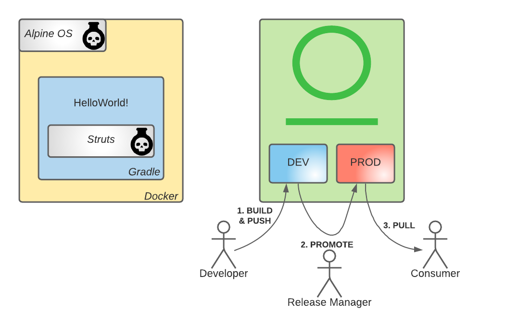
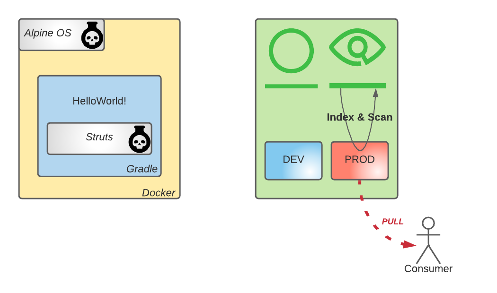

## Context - 1 
- You are developing a new software and security is not a concern

## Objective - 1

- Create a Gradle project and ship the archive in a Docker image
- Upload the artifacts to Artifactory
- Promote the Docker image to a production grade repository
- Download the Docker image

struts library and alpine base image have several CVEs.
A critical vulnerability is present on both allowing remote code execution.

## Context - 2

- Security team is running a security audit
- You want to swiftly confirm that everything is fine security wise

## Objective - 2

- Configure JFrog Xray